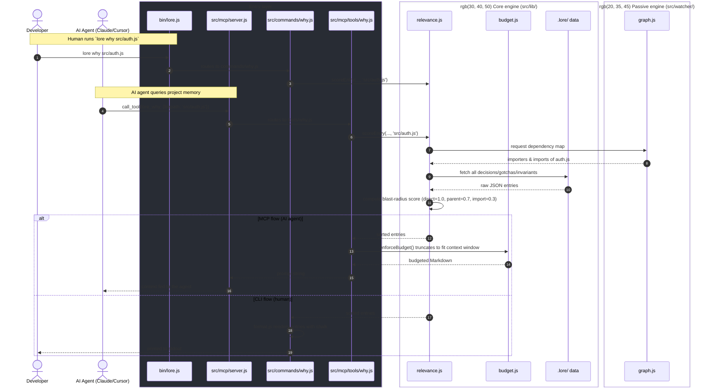

# Architecture

Lore is a Node.js CLI built around the Unix philosophy: small, composable modules that read and
write a plain-JSON knowledge base committed to the host repo's `.lore/` directory.

## Directory layout

```text
Lore/
├── bin/
│   └── lore.js          # CLI entry point, command registration, interactive menu
├── src/
│   ├── commands/         # Thin CLI wrappers — one file per `lore <command>`
│   ├── lib/               # Core engine: storage, scoring, embeddings, budgeting
│   ├── watcher/           # Passive capture: AST comment mining, dependency graph, staleness
│   ├── mcp/               # Model Context Protocol server exposed to AI agents
│   └── ui/                # Local web dashboard (vanilla JS + Express)
└── package.json
```

## Entry point (`bin/lore.js`)

Registers every subcommand with [Commander](https://github.com/tj/commander.js). Running `lore`
with no arguments launches an interactive menu (via `inquirer`); an unknown command triggers a
Levenshtein-distance "did you mean" suggestion.

## Core engine (`src/lib/`)

The backbone of Lore — all business logic for reading, writing, and scoring the knowledge base
lives here, independent of the CLI or MCP layers.

- **`entries.js` / `index.js`** — read/write entry files under `.lore/` and maintain a lightweight
  index so commands don't have to crawl the filesystem on every run.
- **`relevance.js`** — the *blast radius* algorithm behind `lore why`. Scores how relevant an entry
  is to a given file:
  - direct file link — weight `1.0`
  - parent directory link — weight `0.7`
  - imported file — weight `0.3`
  - importer of the file — weight `0.2`
- **`embeddings.js`** — talks to a local Ollama instance (`nomic-embed-text`) to generate vector
  embeddings for entries and rank them by cosine similarity.
- **`budget.js`** — truncates context (dropping the lowest-relevance entries first) so the MCP
  server never exceeds an LLM's context window.

## Commands (`src/commands/`)

Thin wrappers: parse CLI input, format output with `chalk`, and delegate to `src/lib/`.

- **`init.js`** — bootstraps `.lore/` and installs the "architect-in-the-loop" post-commit hook.
- **`prompt.js`** — runs semantic search and formats a zero-shot system prompt for pasting into
  any LLM.
- **`ui.js`** — starts the Express dashboard, exposing `/api/stats`, `/api/drafts`, etc.

## Passive engine (`src/watcher/`)

- **`comments.js`** — parses JS/TS with `@babel/parser`, extracts comments matching signal words
  (`WARNING:`, `HACK:`, `IMPORTANT:`), and drafts entries for review.
- **`graph.js`** — walks `import`/`require` statements to build the dependency graph
  (`.lore/graph.json`) that powers relevance scoring.
- **`staleness.js`** — compares a file's `mtime` against the timestamp an entry was last verified.

## MCP server (`src/mcp/`)

Implements `@modelcontextprotocol/sdk` so AI agents (Claude Code, Cursor, etc.) can query the
knowledge base directly. Each file under `src/mcp/tools/` maps one MCP tool (e.g. `lore_why`) to
the corresponding logic in `src/lib/`.

## Web dashboard (`src/ui/public/`)

A dependency-free vanilla JS + CSS frontend. `app.js` fetches from the local API and renders stats,
search, and the draft-review flow.

## Data flow: `lore why src/auth.js`


